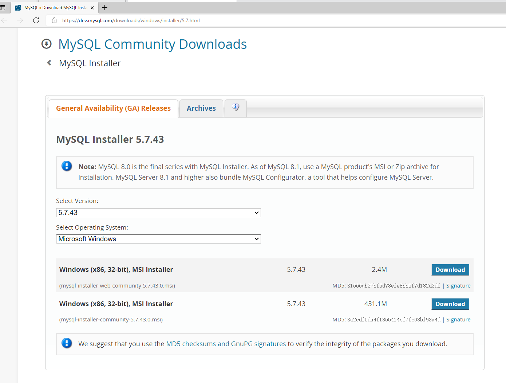

# 安装

## 在 Windows 10 操作系统中安装

### 使用安装包安装

使用浏览器打开https://dev.mysql.com/downloads/windows/installer/5.7.html，

点`Download`下载

### 使用面板安装

#### 使用小皮面板安装

#### 使用宝塔面板安装

## 在 CentOS 操作系统中安装

### 使用yum安装

### 使用面板安装

#### 使用小皮面板安装

#### 使用宝塔面板安装