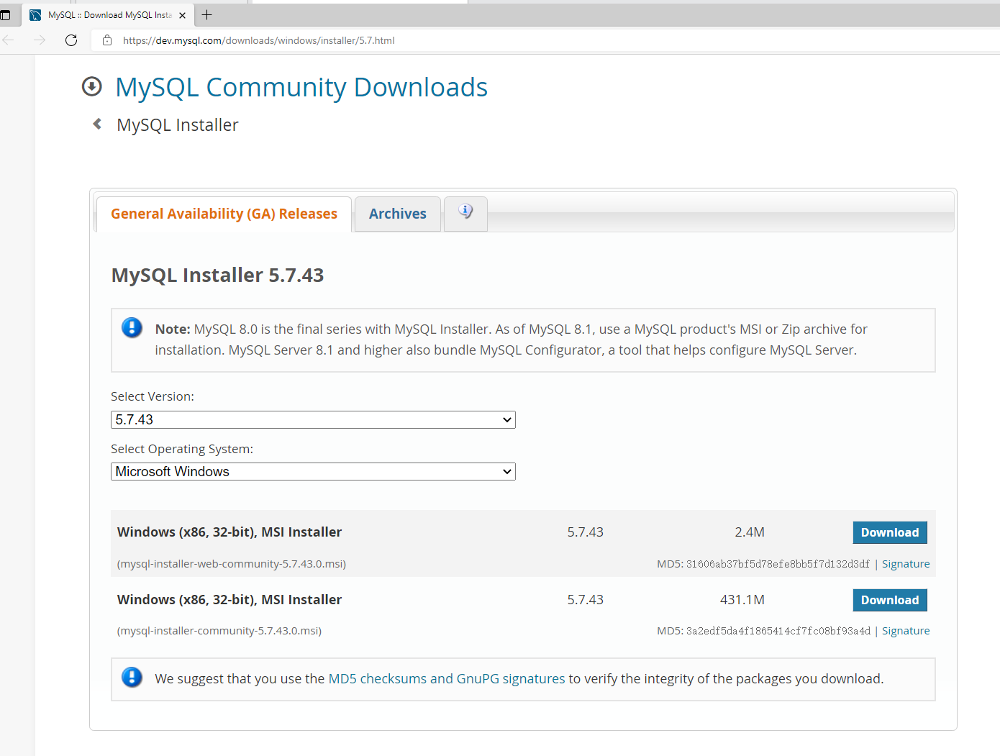
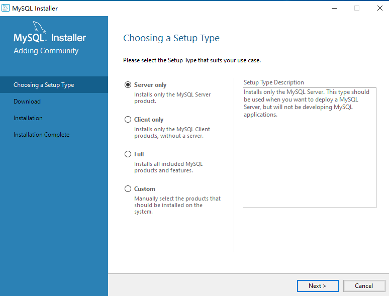
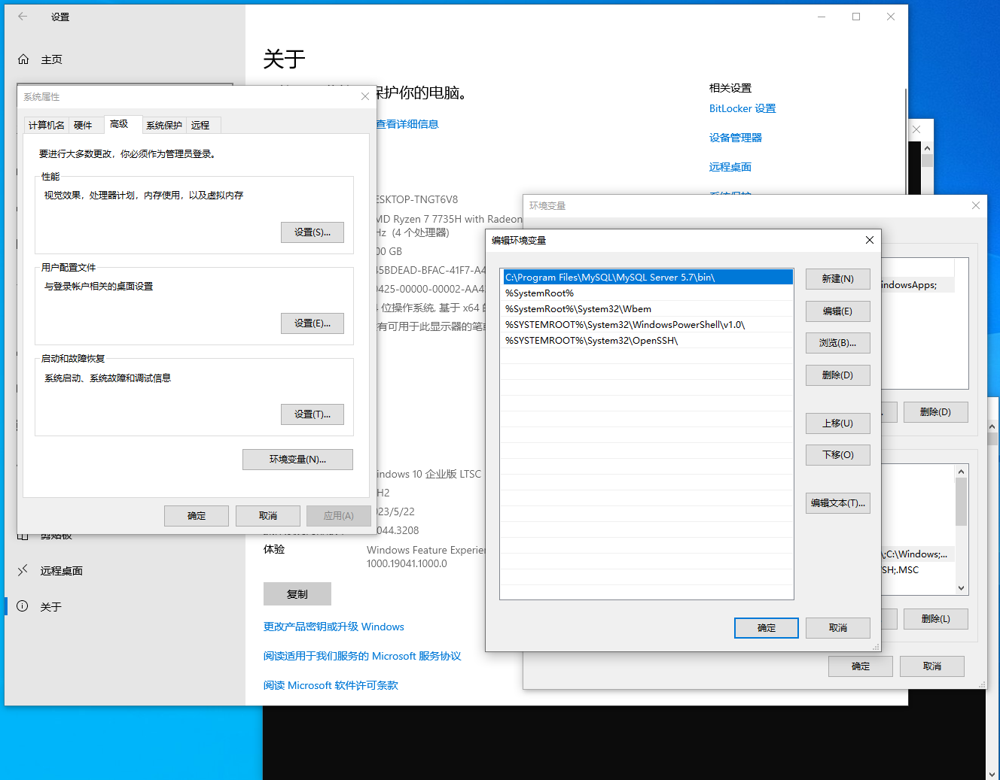

# 安装

## 在 Windows 10 操作系统中安装

### 使用安装包安装

使用浏览器打开https://dev.mysql.com/downloads/windows/installer/5.7.html



点`Download`下载，或者直接打开https://dev.mysql.com/get/Downloads/MySQLInstaller/mysql-installer-community-5.7.43.0.msi

然后打开这个下载好的文件



根据自己的需求选择选项

安装完成后，使用cmd输入mysql

```bat
mysql
'mysql' 不是内部或外部命令，也不是可运行的程序
或批处理文件。
```

什么，你的电脑少了环境变量？老办法，加上去就行了



我的路径是`C:\Program Files\MySQL\MySQL Server 5.7\bin\`，根据实际情况加上去

重新打开cmd，输入命令测试一下

```bat
mysql -u root -p
Enter password: ******
Welcome to the MySQL monitor.  Commands end with ; or \g.
Your MySQL connection id is 4
Server version: 5.7.43-log MySQL Community Server (GPL)

Copyright (c) 2000, 2023, Oracle and/or its affiliates.

Oracle is a registered trademark of Oracle Corporation and/or its
affiliates. Other names may be trademarks of their respective
owners.

Type 'help;' or '\h' for help. Type '\c' to clear the current input statement.

mysql>
```

现在应该算安装完成了

### 使用面板安装

#### 使用小皮面板安装

#### 使用宝塔面板安装

## 在 CentOS 操作系统中安装

### 使用yum安装

### 使用面板安装

#### 使用小皮面板安装

#### 使用宝塔面板安装